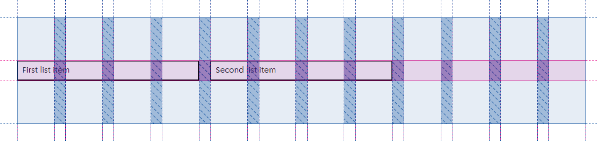
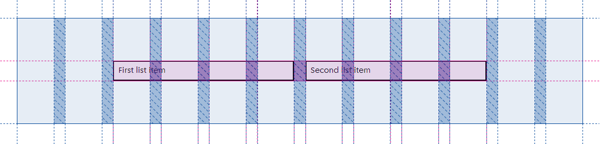

# Grid components

The Grid components are used to define the layout of components on a page. It uses CSS grids.

It consists of four items.

## Grid

This component sets a 12 column grid on desktop and 4 columns on mobile. You can set the number of rows with the numberOfRows prop.
This component is an extension of the Container component, so you can use the same horizontalPadding and verticalPadding props.

## GridItem

This component allows you to define its placement, width and height on the grid.
With the `colStart` and `rowStart` props you define in which column and row the component is placed.
The following code would place the component on the second row and third column (of 12).

`<GridItem colStart={3} rowStart={2}>`

With the `colRange` and `rowRange` props you define how many columns and rows the component spans.
The following code would have the component span two rows and four columns.

`<GridItem colRange={4} rowRange={2}>`

You can set all four of these props with a number, which means it will be the same for all viewport widths, or with an object with `small` and `large` keys.
This will change the value when the viewport width is bigger or smaller than a certain amount of pixels.
The following code would have the component span three rows and four columns on desktop, and one row and two columns on mobile.

`<GridItem colRange={{ small: 2, large: 4 }} rowRange={{ small: 1, large: 3 }}>`

## gridItemStyle

The styling for `GridItem` is also exported seperately. This might be useful if you want to add the `GridItem` functionality to an already existing component.
There are three ways to do this:

- You can add these styles to a component you define yourself, like so:
```
const StyledList = styled.ul`
  /* styles... */

  ${gridItemStyle}
`
```

- You can add these styles to an existing styled component, like so:
  `<AmsterdamStyledComponent css={gridItemStyle} />`

- You can add these styles to a vanilla html element, like so:
  `<div css={gridItemStyle} />`

## subgridStyle

CSS grids work well if you want to place __direct__ descendents of an element on a grid. However, you can't place elements further down the tree on the same grid. The official solution to this problem is the [subgrid](https://developer.mozilla.org/en-US/docs/Web/CSS/CSS_Grid_Layout/Subgrid). Unfortunately, at the time of writing `subgrid` isn't supported on most major browsers.

A workaround to this problem is to define a `gridItem` as a `grid` itself as well. This is what `subgridStyle` is. The following example places two list items with a width of four columns in a list, which is a subgrid (pink color in the image) with the same dimensions as the main grid (blue color in the image).

```
const StyledList = styled.ul`
  list-style: none;
  margin: 0;
  padding: 0;

  ${subgridStyle}
`

const StyledItem = styled.li`
  border: 2px solid black;
  padding: 8px;

  ${gridItemStyle}
`

<Grid>
  <StyledList colRange={12}>
    <StyledItem colRange={4}>First list item</StyledItem>
    <StyledItem colRange={4}>Second list item</StyledItem>
  </StyledList>
</Grid>
```



A subgrid item has the same props as `gridItem`, so it doesn't have to be the same width as the main grid, it doesn't have to start in the first column and the width of the subgrid can change based on the viewport width. The following example places two items with a width of four columns above the breakpoint and two columns below in an unordered list with a width of eight columns above the breakpoint and four below. The subgrid starts in the third column. The `column-gap`s will be the same for all items, even though `StyledList` (pink color in the image) has a different width than `Grid` (blue color in the image).

```
<Grid>
  <StyledList
    colRange={{ small: 4, large: 8 }}
    colStart={{ small: 1, large: 3 }}
  >
    <StyledItem colRange={{ small: 2, large: 4 }}>
      First list item
    </StyledItem>
    <StyledItem colRange={{ small: 2, large: 4 }}>
      Second list item
    </StyledItem>
  </StyledList>
</Grid>
```


